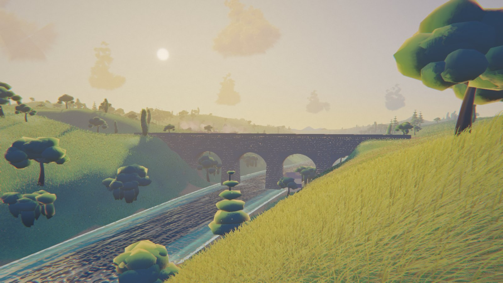

# Hoshi-no-Tani — The Valley of Stars

### ▶ [**Play it in your browser →**](https://howarddc.github.io/hoshi-no-tani/)

A late-summer afternoon in a valley that does not exist, rendered in real time
in your browser. Every blade of grass, every stone in the viaduct, every cloud,
and every note of the soundtrack is **generated by code**. There are no
textures, no 3D models, and no audio recordings anywhere in this repository —
just about 6,000 lines of JavaScript and GLSL, and one library (Three.js).

<!-- Add a screenshot here once you have one:
     
     A good frame: stand on the spawn knoll looking west toward the viaduct. -->

If you have never taken apart a demo like this before, this README is written
for you. It will get it running in under a minute, then walk you through
changing something and seeing the result.

---

## See it running

**Easiest:** open the [live version](https://howarddc.github.io/hoshi-no-tani/).
Nothing to install.

**Or run it from your own machine:** download or clone the repo and
double-click **`dist/index.html`**. That's it — no install, no build, no
server. It is a single self-contained file and it opens straight from your
filesystem, which is a deliberate property of this project rather than a happy
accident (see [How it fits together](#how-it-fits-together)).

Either way you need an internet connection, because Three.js is loaded from a
CDN. Give it a few seconds to build the world (it is carving a terrain, growing
a meadow and stacking clouds while you wait), then click **Enter the valley**.

It opens on the lowest quality preset so it starts fast on any machine. Press
**`3`** or **`4`** once you are in, and the meadow fills in properly.

### Controls

| Key | Action |
| --- | --- |
| `W` `A` `S` `D` | Walk |
| `Shift` | Run |
| Mouse | Look — click once to capture the pointer |
| `F` | Toggle flight, then `Space` / `Ctrl` for up and down |
| `T` | Summon the train |
| `C` | Cinematic camera — hands off, it flies itself |
| `H` | Settings panel |
| `P` | Pause |
| `1`–`4` | Quality: low, medium, high, ultra |
| `Esc` | Release the pointer |

### Things to try first

Walk to the viaduct and stand underneath it. Press `T` and watch the train
cross above you — the valve gear is actually solved, so the rods move the way
rods move. Press `F` and fly up to the cloud deck at 980 m, then follow the
railway line back down. Then come back and just stand still in the grass for a
moment with the sound on, because the wind you hear is driven by the same field
that is bending the blades in front of you.

Press `H` at any point for quality, wind, exposure and audio controls.

---

## Make your first change

This is the fun part, and the reason the code is organised the way it is.

**Set up a dev loop first.** Serve the `src/` folder and your changes appear on
reload, with no build step:

```bash
cd src && python3 -m http.server 8000
```

Open <http://localhost:8000>. Now edit a file, hit reload, see it. (When you
want the double-clickable single file again, run `python3 tools/build.py` — see
[How it fits together](#how-it-fits-together) below for why both exist.)

### 1. Repaint the whole valley — `src/modules/palette.js`

Every colour in the film is in one object. Change a hex code, reload, done.

```js
export const P = {
  skyZenith:'#4E80B4', skyUpper:'#7BA9CE', ...
  gTip:'#C6D46B', gUpper:'#93B84E', gMid:'#6C9A47', ...
```

Try pushing the grass colours (`gTip`, `gUpper`, `gMid`, `gLow`) toward oranges
and browns for autumn. The colours flow into the shaders automatically — they
are converted to linear space and injected into the GLSL as constants when the
shaders are compiled at startup, so you never touch a shader to recolour
anything.

### 2. Move the sun — `src/modules/config.js`

```js
sunElev: 13.5,   // degrees above the horizon
sunAzim: 292.0,  // degrees, 0 = north, increasing toward east
```

Drop `sunElev` to `4` for a raking, nearly-sunset light with very long shadows.
Push it to `45` for a flat midday. Change `sunAzim` to swing the light around
the valley and watch which hillsides catch it.

**A thing worth noticing:** the sky will not follow the sun. The sky is a
*painted* gradient — hand-picked colours in the palette — not a physical
scattering simulation. So a low sun with a midday sky looks wrong, and fixing
that means repainting the sky colours too. That trade (painted, not simulated)
is deliberate and it is why the whole thing looks like a film cel instead of a
photograph. Making the sky respond to the sun automatically is a genuinely
interesting project if you want one.

### 3. Change where you start — no file editing needed

Add `?cam=x,z,heading,pitch` to the URL to spawn anywhere:

```
http://localhost:8000/?cam=-46.5,92.1,180,-8   # spawn point, facing south
http://localhost:8000/?q=3&d=1.4               # ultra preset, dense grass
http://localhost:8000/?post=0                  # post-processing off
```

These work on the [live version](https://howarddc.github.io/hoshi-no-tani/)
too, so a URL is a shareable viewpoint — for example
[the valley at ultra quality](https://howarddc.github.io/hoshi-no-tani/?q=3&d=1.4).

`x` and `z` are world metres and `heading` is degrees, so you can put the
camera anywhere in the valley. Note that `?d=` is a **multiplier**, not a
percentage — `1.0` is full density and the default is `0.2`. (The slider in the
settings panel shows the same value as a percentage, which is a wrinkle worth
knowing before you type `?d=100` and wonder why your browser stopped
responding.)

That last one is worth doing once. `?post=0` bypasses the bloom, the
watercolour softening and the film print curve, and shows you the raw render.
The difference is startling, and it is a good lesson in how much of the "look"
of a piece like this is the final image processing rather than the geometry.

### 4. Change the grass — `src/modules/config.js`

```js
export const RINGS = [
  { chunk:  9,  blades:  89000, near:0,  far:26,  dn:7,  wpx:1.70, hs:1.00 },
  ...
```

Grass is drawn in four concentric rings of decreasing detail. `hs` is height
scale — raise it and you are wading through a hayfield. The comments around
this table explain the density law in some depth, and they are worth reading
if you have ever wondered how a million-blade meadow is made to run at all.

### 5. Build something — `src/modules/village.js`

The village is built with a small toolkit — `pbox`, `pcyl`, `proof` (a gabled
roof) — that pushes vertices into a buffer. Copy an existing cottage, move it,
change its roof colour. Two rules: register it for collision with `pushSolid`
so you cannot walk through it, and add it to the scene with `addMesh` (see
below), or it will silently cast no shadow.

---

## How it fits together

If this is your first time inside a project shaped like this, here is the tour.

### It started as one enormous file

The original was a single 6,184-line HTML file. That is a completely reasonable
way to write a demo — it is self-contained and it just runs — but it is a hard
thing to *extend*: every change touches the same file, diffs are unreadable,
and two people cannot work on it at once.

So it is now **22 ES modules** in `src/modules/`, split along the boundaries
the original author had already marked with comment banners:

```
config.js  palette.js  math.js  scene-contract.js  glsl.js
terrain.js  sky.js  wind.js  grass.js  river.js  trees.js
viaduct.js  railway.js  village.js  train.js  post.js
walker.js  audio.js  materials.js  field.js  track-ref.js  main.js
```

### But it still has to be one file

Here is the interesting constraint. A browser will happily run an *inline*
`<script type="module">` from a `file://` page — which is why you can
double-click `dist/index.html`. But the moment that script does
`import './terrain.js'`, the browser blocks it: a relative import from a
`file://` page is a same-origin request from an opaque origin, and that is
forbidden.

So splitting the code into modules would have destroyed the single best
property of the project — that you can double-click it and it works.

The answer is `tools/build.py`: about 300 lines of dependency-free Python that
concatenates the modules back into one inline script and writes
`dist/index.html`. Source you can navigate; artifact you can double-click.

```bash
python3 tools/build.py          # rebuild dist/index.html
python3 tools/build.py --check  # verify it is in sync (this is what CI runs)
```

Concatenation is a crude bundling strategy and it only works because of an
accident of history: the code *was* one file, so every top-level name is
already unique and the original ordering is known to be correct. The build
script asserts all of that — unique names, no import cycles, no imported name
that its module does not actually export — and refuses to emit a bundle if any
of it breaks. A loud failure is much cheaper than a subtly wrong bundle.

### One rule you have to know

Whether a mesh casts a shadow is decided by one thing: whether it carries a
depth material. Forget it, and your new building silently stops casting a
shadow — and under a sun sitting 13.5° above the horizon, where shadow carries
most of the shape, that reads as a lighting bug and sends you looking in
entirely the wrong place.

So nothing is added to the scene directly. Everything goes through a factory
where the decision is a **required argument**:

```js
addMesh(scene, mesh, someDepthMaterial);  // casts a shadow
addMesh(scene, mesh, NO_CAST);            // deliberately does not
```

You cannot skip the decision, only make it. This is the kind of thing worth
stealing for your own projects: when a mistake is silent, make it impossible
rather than documenting it.

---

## What's clever in here

Reasons to go reading the source. The comments explain *why*, including the
approaches that were tried and rejected, which is rarer and more useful than
comments explaining what.

- **A million blades of grass that actually runs.** The near rings are drawn
  twice — once with colour writes off, purely to lay down depth — so the
  hardware can throw away the ~30 blades of overdraw stacked at every pixel
  before doing any shading work.
- **One number chosen for the instruction count.** The grass density exponent
  is 1.5 rather than 1.45, because at exactly 1.5 the shader computes it as
  three single-cycle instructions instead of calling `pow()` — and it runs on
  roughly 12 million vertices per frame.
- **Cloud shadows that cost one texture fetch.** The cloud coverage field is
  thirteen octaves of warped noise. Rather than evaluate that per pixel in six
  different shaders, it is baked once per frame into a small map.
- **The CPU and GPU never disagree.** The terrain height function is written
  twice, once in each language, deliberately mirroring each other — so your
  feet, the grass roots, the camera and the rendered ground are guaranteed to
  agree about where the hill is.
- **The soundtrack is synthesised from nothing.** Noise buffers, oscillators,
  filters, and a reverb whose impulse response is generated from decaying
  noise. The wind you hear is sampled from the same field that bends the grass.

---

## Working on it with an AI agent

There is an [AGENTS.md](AGENTS.md) in the root. If you point Claude Code,
Cursor, or a similar tool at this repository, it will read that file and pick
up the architecture, the invariants, the house style, and the traps — including
several that cost real time to discover the first time.

It is also just a decent orientation document if you are human. It goes
considerably deeper than this README.

---

## Requirements

Nothing to install. A browser with WebGL2 (any current one), an internet
connection for the Three.js CDN, and Python 3 if you want to run the build
script or a local server.

---

## Attribution and licence

This repository is a fork, and the work in it has two authors.

**The valley itself** — the procedural terrain, sky and cumulus, wind field,
grass, river, trees, viaduct, railway, village, steam train, post-processing
chain and synthesised audio — was created by **Lentils** and published on
CodePen:

- Original pen: <https://codepen.io/editor/lentils801/pen/019f9b4b-10d7-7f77-817f-f4eb83fdb289>
- Original author: Lentils (<https://codepen.io/lentils801>)

**Making it portable and extensible** — the module split, the build system, the
enforced scene contract, the documentation and the CI checks — is by
**Rob Howard** (<https://github.com/howarddc>).

Both parts are released under the **MIT License**. Both copyright notices are
recorded in [LICENSE.txt](LICENSE.txt) along with a fuller breakdown of who
wrote what, and both must be preserved in any copy or substantial portion of
this software, including derivative works. The generated `dist/index.html`
carries them too, since it is built to be distributed on its own.

**If you fork this**, keep both notices. Beyond that, go and do what you like
with it — that is rather the point.
